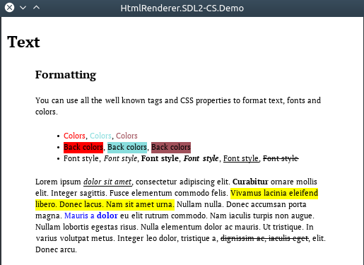

# HtmlRenderer.SDL2-CS
## Description
This is multiplatform graphics adapter for [HtmlRenderer.Core](https://github.com/ru-ace/HTML-Renderer) based on [SDL2](https://www.libsdl.org/), [SDL2_image](https://www.libsdl.org/projects/SDL_image/), [SDL2_ttf](https://www.libsdl.org/projects/SDL_ttf/) via [SDL2-CS wrapper](https://github.com/flibitijibibo/SDL2-CS)

The main goal was to use HtmlRenderer to create a GUI. But at the moment I have doubts that this can be implemented in a short time. The main problem: HtmlRenderer was created for rendering static html-documents, and the parts that were needed for the graphical interface are missing (you can read "in progress" section in [HtmlRenderer](https://github.com/ru-ace/HTML-Renderer))

## Status 

The adapter basically works and is ready to render documents. But the development was suspended for the reasons described earlier.

Example of rendering [02.Text.htm](HTML-Renderer/Source/Demo/Common/Samples/02.Text.htm)

